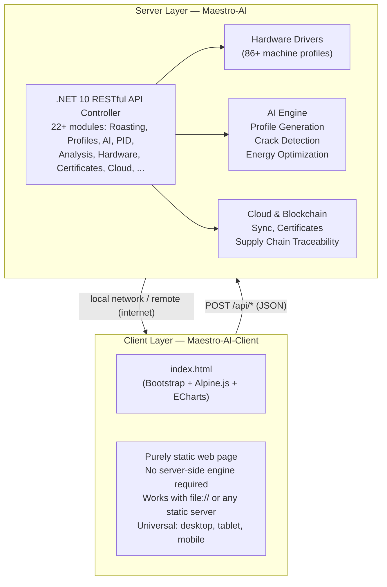

# Maestro-AI

[](https://raw.githubusercontent.com/Andrea-Bruno/AI-Maestro/main/install.sh)
[](https://github.com/Andrea-Bruno/AI-Maestro/releases/latest)


## AI Roasting Machine — Intelligent Coffee Roasting Platform

Imagine being able to reproduce your best roast **every single time**, even when the green coffee changes from one harvest to the next. Imagine checking the status of your roasting machine from your phone while you are away from the factory, or having every batch automatically certified with a digital birth certificate that your customers can scan and trust.

This is what Maestro-AI does. It is a system made of two parts: a powerful **control unit** (the server) that handles all the intelligence, and a **universal interface** (the client) that runs on any screen — desktop, tablet, or mobile phone. No complex setup, no server-side software to install on the client. You just open a web page and you are in control.

Every roaster knows that the real challenge is not roasting well once — it is roasting well every time, batch after batch, even when the green coffee changes from one harvest to the next. Maestro-AI solves this by learning from thousands of roasts and automatically adapting the curve to the beans you are using today. The result is the same quality you are proud of, delivered consistently, without having to reinvent the wheel each time.

At the same time, the system works to reduce your energy consumption. By analyzing every thermal curve and optimizing it against quality outcomes, Maestro-AI finds the most efficient path to your target profile. Less gas or electricity per cycle means lower operating costs and a smaller environmental footprint — two things that matter more and more in this industry.

And because you cannot always be standing next to the machine, Maestro-AI lets you monitor your production from anywhere. Production manager, quality control, or business owner — you can see live telemetry, review past roasts, and run diagnostics from your phone, your tablet, or any computer. Whether you are on the factory floor or on the other side of the world, you know exactly what is happening.

The system connects to over 86 machine profiles, so there is no need to buy new hardware. It talks to what you already have. Every batch can also be automatically certified with a blockchain-backed digital certificate — a verifiable quality document that your customers can scan and trust, from the green coffee origin all the way to the cup.

Three operating modes — Monitoring, Easy, and Full — make sure that everyone, from the machine operator to the master roaster, finds the right level of control. No clutter, no confusion, just the tools you need when you need them.

Maestro-AI was built by people who understand that consistency is the real currency of the specialty coffee business. It is not about technology for its own sake: it is about giving you the tools to roast better, waste less, and prove the quality of what you produce.

---

### How it works, in plain language

The **server** is the brain. It talks to your roasting machine, reads the sensors, runs the AI, and exposes all its capabilities through simple API calls. It runs on a PC or a small server in your facility.

The **client** is the screen you look at. It is a simple web page — no different from visiting a website — that connects to the server and shows you everything: real-time curves, roast profiles, diagnostics, reports. Open it on a computer in the control room, on a tablet on the production floor, or on your phone at home. It works the same way everywhere.

Because the client is just a static page, there is **nothing to install** on your devices. No apps, no plugins, no server-side frameworks. Just a browser.

---

### Technical overview

**Maestro-AI** is built with a clean separation of concerns: a pure server backend that acts as the **controller**, and a fully static web client that works on **any device** — desktop, tablet, or mobile — without requiring any server-side rendering engine (no ASPX, PHP, JSP, or similar).

---

## Architecture Overview



### Maestro-AI (Server) — The Controller

The server is a pure **.NET 10** application that acts as the brain of the system. It exposes **all functionality through REST APIs** (`POST /api/{Method}`), making every feature — from roasting control to AI profile generation, from hardware management to blockchain certification — accessible programmatically.

- **No UI rendering** — serves only data and logic
- **22+ API modules** covering roasting, AI, hardware control, diagnostics, and more
- **86+ roasting machine profiles** with configurable hardware drivers
- **Real-time telemetry** from sensors (temperature, weight, crack detection)
- **AI engine** for profile generation, predictive analysis, and energy optimization
- **Cloud synchronization** and **blockchain-based certification**

### Maestro-AI-Client (Client) — Universal Interface

The client is a **purely static web page** built with HTML5, CSS3, and JavaScript (Bootstrap 5 + Alpine.js + ECharts). It communicates with the server **exclusively via REST API calls**.

- **No server-side engine needed** — works by opening `index.html` directly (`file://`) or via any static web server
- **Universal device support** — responsive design works on desktop, tablet, and mobile browsers
- **Works locally and remotely** — just configure the server URL (default: `http://localhost:5252`)
- **6 built-in languages** — English, Italian, Spanish, French, German, Russian (all inline, no server round-trips)
- **3 GUI modes** — Monitoring (read-only), Easy (daily operations), Full (all features)

### Remote Monitoring & Diagnostics

A key feature of the platform is its **remote monitoring capability**. With the client set to **Monitoring mode**, any device can connect to a remote Maestro-AI server and:

- View real-time roasting telemetry (BT/ET curves, phase detection)
- Monitor system health and hardware diagnostics
- Access error logs and diagnostic reports
- Perform remote troubleshooting

This makes Maestro-AI ideal for production floor screens, remote quality control, and distributed oversight across multiple roasting facilities.

---

### Quick Start

```bash
# 1. Start the server
cd Maestro-AI
dotnet run --launch-profile http
# Server running on http://localhost:5252

# 2. Open the client
#    Simply open Maestro-AI-Client/index.html in your browser
#    (double-click or drag into any modern browser)
```

### Connecting from Another Device

1. Ensure the server machine is reachable on your network (or the internet)
2. On the client device, open the settings and set **Server URL** to the server's address
3. Enable **Monitoring mode** for read-only remote viewing

---

## Core Features

#### AI & Intelligence
- **AI Profile Generation** — Automatic roasting profile creation based on bean characteristics
- **Predictive Analysis** — Machine learning-based optimization suggestions
- **Smart Crack Detection** — AI-powered first and second crack identification
- **Energy Analysis** — Consumption optimization and sustainability metrics

#### Roasting Management
- **Profile Design & Management** — Full lifecycle: create, modify, compare, and archive
- **Real-Time Monitoring** — Live temperature tracking (BT/ET), phase visualization
- **Phase Detection** — Automatic detection of roasting phases
- **Multi-Machine Support** — 86+ different roasting machine models
- **PID Controller** — Precision temperature control algorithms

#### Analysis & Reporting
- **Profile Comparison** — Side-by-side analysis of multiple roasting profiles
- **Cupping Evaluation** — Structured flavor profile assessment
- **Energy Reports** — Detailed energy consumption analysis
- **Advanced Reporting** — Custom report generation and analytics

#### Security & Blockchain
- **Digital Certification** — Blockchain-based batch certification with QR codes
- **Supply Chain Traceability** — From green coffee to the final cup
- **Digital Identity** — Cryptographic machine identity for data authenticity
- **Role-Based Access** — Monitoring, Easy, and Full modes with PIN protection

---

<details>
<summary><strong>Scientific Foundation — The Whitepaper</strong></summary>

<br>

# AI Roasting Machine — GREEN

## Project for the Integration of Artificial Intelligence in the Production of Roasted Coffee and Other Roasted Products, Aimed at Quality Improvement and Energy Consumption Optimization Oriented Towards "Green"

This project aims to revolutionize the coffee roasting process through the use of artificial intelligence, integrating advanced analytics, automation, and human input into a distributed and secure system. The idea is based on the collection and processing of data from roasting machines equipped with state-of-the-art sensors, capable of monitoring in real-time fundamental parameters such as the heat curve, development time, first crack point, and heat profile. This data is cross-referenced with the characteristics of the green coffee, analyzed before roasting in terms of density, moisture, color, and aromatic potential, using tools such as spectrophotometers, electronic noses, and pycnometers.

Once roasting is complete, the coffee undergoes a second phase of objective analysis, which includes measuring the degree of roast using the Agtron scale, evaluating aroma through GC-MS devices or simplified sensors, and checking post-roast density. All collected data is sent to a private cloud infrastructure, protected by end-to-end encryption and advanced cybersecurity systems. The cloud software uses this information to train an artificial intelligence model, which progressively learns the correlations between input parameters and the quality of the final result.

The system is designed to be collaborative: all machines within the same group actively participate in data collection, contributing to the construction of a shared and continuously evolving model. This process is supplemented by the input of professional tasters, who conduct tasting sessions according to standardized protocols, always using the same water, the same coffee machine settings, the same pressure, and quantity. Their judgments, along with preparation parameters, are integrated into the cloud and used to further refine the AI's training.

The result is an intelligent and scalable platform, capable of optimizing roasting based on coffee characteristics and sensory preferences, ensuring consistency, quality, and innovation. This approach overcomes the limitations of traditional roasting, transforming each production cycle into an opportunity for continuous learning and improvement.

### Devices Necessary to Complete the Machines and Support Production with AI Tools

Here are the main equipment divided by type of input:

#### 1. For Color (and Degree of Roast)

Color is the parameter most directly correlated to the degree of roast.

- **Roast Meter (Colorimeter / Spectrophotometer)**: This is the standard instrument for measuring the color of ground roasted coffee.
- **Function**: It illuminates a standardized sample of ground coffee and measures the reflected light.
- **Scale**: The result is expressed on standard scales such as **Agtron** (the most common in the North American industry), which ranges from about 25 (very dark roast) to 100+ (very light roast). Similar values are offered by other scales like **Colorette** or the **SCAA Roast Color Classification**.
- **Purpose**: To guarantee **consistency** from one roasting batch to another. A roaster knows that for their espresso they must reach an Agtron value of 55, while for a filter roast, 65.

#### 2. For Odor (Aroma Analysis)

Odor, or rather aroma, is a complex set of hundreds of volatile compounds. Its analysis is the most technological.

- **Electronic Nose (e-Nose)**:
  - **Function**: It uses a series of chemical sensors that react to the volatile compounds emitted by the coffee. The reaction pattern from all sensors is sent to software that, using statistical and AI models, compares it with a database of reference profiles (e.g., "aromatic coffee", "defective coffee", "tropical fruit notes").
  - **Purpose**: To detect **defects** (such as mold, excessive fermentation), classify coffee origins, and sometimes suggest an aromatic profile. It is used mainly for quality control.

- **Gas Chromatograph coupled with Mass Spectrometry (GC-MS)**:
  - **Function**: This is the most powerful and precise analysis instrument. It physically separates all volatile compounds present in the aroma and identifies each one molecule by molecule.
  - **Purpose**: Used primarily in **research and development** for scientific studies on roasting, to identify specific chemical markers of certain aromas (e.g., what makes a coffee "fruity"), or for very high-precision analysis. It is not an instrument for daily quality control.

#### 3. For Specific Weight and Density

Specific weight (or density) is a crucial indicator of the bean's physical structure.

- **Gas Pycnometer**:
  - **Function**: This is the industrial standard. It measures the volume of a sample of beans (or grounds) by displacing an inert gas. Knowing the mass of the sample (weighed on a precision scale), the density is calculated with very high accuracy.
  - **Purpose**: Coffee that is too dense (high density) might not have been roasted enough. Coffee with low density might be over-roasted or come from low-quality raw material. Here too, the goal is **consistency**.

- **Image Analyzers**:
  - Some advanced systems use high-resolution cameras and image analysis software to estimate bean volume and density, in addition to evaluating their color and identifying visual defects.

> **Notes**: These machines do not provide a subjective "judgment" like a human taster (a Q Grader), but they provide quantitative and objective data that are fundamental for evaluating product quality and consistency. However, human sensory evaluation remains an indispensable element in the AI training process. The judgments of professional tasters, expressed according to standardized and repeatable protocols, are integrated into the system as a qualitative reference, helping to create a correlation between technical parameters and sensory perception. In this way, the AI does not replace human experience but incorporates it as a guide to interpret data and improve the predictive capability of the model. Tasting thus becomes an active component of the training, allowing the technology to learn not only from numbers but also from the nuances that only the human palate can perceive.

### GREEN PRODUCTION

In the context of the energy transition and growing attention to industrial sustainability, the project presented here proposes an innovative technology, eligible for international patenting, which applies artificial intelligence to optimize energy consumption in the coffee roasting process. The approach does not intervene on the physical components of the machines but acts exclusively on the intelligence of the thermal process, making each roasting cycle more energy efficient without compromising quality.

Coffee roasting is a thermal process that can be represented on a Cartesian plane, where the x-axis (X) represents time and the y-axis (Y) represents the thermal energy supplied. The curve describing the energy trend over time is directly correlated to the quality of the roasted coffee. The area under this curve represents the total energy absorbed during roasting. The system's goal is to identify, via AI, the curve that minimizes this area while guaranteeing an optimal aromatic and sensory profile.

Formally, if we denote by E(t) the function describing the energy supplied over time t, the total energy absorbed is given by:

$$A = \int_{t_{0}}^{t_{f}}E(t)dt$$

where t_0 is the start of roasting and t_f the end. The artificial intelligence, trained on thousands of thermal curves and sensory results, is able to identify the function E(t) that minimizes A while keeping the qualitative result within predefined thresholds. This is achieved through techniques of non-linear regression, multi-objective optimization, and analysis of energy gradients.

The system is based on a neural network trained with data from distributed roasting machines, which record in real-time parameters such as temperature, development time, cracking, and aromatic profile. These are supplemented by sensory evaluations performed by professional tasters, which allow correlating energy efficiency with perceived quality. The data is collected in a private cloud, protected by end-to-end encryption, where the AI model is continuously updated.

The proposed technology allows for the dynamic adaptation of the roasting curve based on the characteristics of the green coffee and environmental conditions, reducing the energy used without changing the energy source or the machine's structure. In this way, a more sustainable, replicable, and scalable roasting process is achieved, responding to the needs of green and conscious production.

This solution represents a concrete step towards energy efficiency in the coffee industry, with potential applications in other thermal sectors. The possibility of patenting the system lies in the unique combination of thermal analysis, AI modeling, and energy optimization, which transforms a traditional process into an intelligent and sustainable platform.

### Technology Serving an Increasingly Green Future

In the global landscape of sustainability, major companies in the food and coffee sector are undergoing a profound transformation, driven by the need to reduce environmental impact and improve energy efficiency throughout the entire production chain. In this context, green technology based on artificial intelligence applied to coffee roasting represents a concrete and strategic solution, perfectly aligned with the stated objectives of multinationals like Nestlé, Lavazza, and Gruppo Cimbali.

Nestlé has outlined an ambitious roadmap towards net-zero emissions by 2050, with the interim goal of halving greenhouse gas emissions by 2030. Through programs like the Nescafé Plan and the Nespresso AAA Sustainable Quality Program, the company promotes regenerative agriculture practices and invests in innovations that improve the sustainability of industrial processes. AI technology for intelligent roasting fits perfectly into this vision, offering a system capable of optimizing the energy consumption of machines without modifying their physical structure. This approach reduces the energy used per roasting cycle, directly contributing to the decarbonization of production processes and the reduction of Scope 1 and Scope 2 emissions.

Lavazza, with its "Roadmap to Zero" strategy launched in 2020, has placed climate protection, responsible resource use, and environmental sustainability at the source at the center of its actions. The company has already achieved significant results, such as recovering 97% of plant waste from coffee processing in its Italian plants and designing coffee machines with energy class A or higher. The integration of an AI technology that dynamically regulates the thermal profile of roasting, based on coffee characteristics and environmental conditions, represents a natural evolution of this strategy. It not only allows tangible energy savings but also improves the sensory quality of the product, thanks to continuous data analysis and the contribution of professional tasters.

Gruppo Cimbali, a leader in the production of professional coffee machines, highlighted in its Sustainability Manifesto that bars and restaurants consume on average 26,000 kWh per year, almost ten times more than an Italian family. The efficiency of equipment is therefore crucial to reduce costs and environmental impact. The proposed AI technology allows direct intervention on the thermal management software, optimizing the energy profile of roasting in real-time. This type of innovation is perfectly compatible with the group's sustainability policies, which include improving the product life cycle, reducing waste, and promoting responsible practices throughout the supply chain.

At the European level, environmental directives like Ecodesign and the strategy for single-use plastics are pushing companies to review their sourcing and design policies. The adoption of smart technologies that reduce waste and improve energy efficiency is now a strategic necessity, not only to comply with regulations but also to access public incentives and obtain environmental certifications such as EMAS or ISO 14001.

In summary, AI technology for green roasting is not just an innovative proposal but a concrete response to the sustainability, efficiency, and quality needs driving the strategies of the main companies in the sector. It allows transforming each production cycle into an act of environmental responsibility, contributing to the construction of a more resilient and conscious future. The invitation to Nestlé, Lavazza, Gruppo Cimbali, and other players in the chain is to integrate this solution into their sustainability programs, to accelerate the transition towards a smarter, cleaner, and more humane production model.

### Hybrid Coffee Roasting System with Selective Irradiation and Artificial Intelligence

Traditional coffee roasting, based primarily on heat transfer by convection and conduction, has intrinsic limitations related to thermal inertia and energy dispersion. The conventional process, while effective, acts in a coarse and non-selective manner, heating the bean from the outside inward and generating thermal gradients that can lead to uneven development of aromatic precursors. To overcome these limitations, a hybrid roasting system is proposed that breaks down the thermal curve into two distinct and synergistic energy components: one generated by a traditional heat source (hot air or radiant surface) and one generated by an electromagnetic wave irradiator with variable frequency, including microwaves and infrared waves. The primary objective is the selective and targeted energy transfer to specific organic compounds within the coffee bean, based on their molecular structure and their absorption capacity in different frequency bands.

The foundational physico-chemical principle is that each family of organic compounds absorbs electromagnetic energy efficiently in a specific frequency band. Water molecules, highly polar, absorb energy particularly efficiently in the microwave band at approximately 2.45 GHz, where the oscillating electric field induces rapid molecular movement (dielectric heating). Sugars, like sucrose and glucose, respond instead to frequencies in the mid-infrared, between 30 and 100 THz, where the vibrations of O-H and C-H bonds convert radiant energy into heat. Fats and triglyceride oils also absorb in the mid-infrared, typically between 50 and 100 THz, due to vibrations of C-H and C=O bonds. Cellulose, a structural component of the bean, absorbs preferentially in the far infrared (15-30 THz) due to vibrations of O-H and C-O-C bonds. Lignin, with its complex aromatic structure, shows broader absorptions, from infrared (10 THz) to visible light (beyond 100 THz), involving both molecular vibrations and electronic transitions.

The hybrid system exploits this principle to dynamically and optimally guide the various phases of roasting. During the initial drying phase, the irradiator emits microwaves that assist faster, more uniform, and deeper evaporation, as heat is generated within the entire mass of the bean and not transferred by conduction from the outside. Subsequently, in the development phase where Maillard reactions and sugar caramelization occur, the system activates an infrared source tuned to the absorption band of sugars (approximately 30-100 THz). This selective energy input accelerates and evens out these fundamental reactions, promoting the formation of desired aromatic compounds and reducing the risk of incomplete development or cold spots. During first crack, a critical exothermic phase, the system dynamically modulates the ratio between traditional and irradiated energy to control the development rate, avoiding destructive thermal peaks and preserving aromatic complexity. In the final phases, irradiation can be selectively directed towards lipid components or lignin to influence the perception of body and the structure of volatile compounds.

It is important to note that these roasting phases are not driven by empirical systems but are based on rigorous scientific calculations supported by the experimental method, which is refined by the heart of the system: an AI-based control unit. The AI system receives as input the data of the green coffee (origin, variety, moisture, density, preliminary spectroscopic chemical analysis) and the desired roast profile (target aromatic profile). During roasting, a series of sensors (NIR spectrometers, thermocouples, color sensors, microphone to detect crack) monitors the product's state in real-time. The AI processes this data and calculates, moment by moment, the optimal distribution of energy between the traditional source and the wave irradiator, determining not only the power but also the most appropriate frequency to emit to interact with the target compounds in that specific transformation phase. Data from each roasting cycle (input, output, energy curves, analyzed qualitative result) are sent to a cloud platform. Here, deep learning machine learning algorithms analyze the enormous historical dataset, identifying non-obvious patterns and correlations between selective irradiation interventions and the final organoleptic result. The model continuously self-trains, refining its prediction algorithms and returning increasingly precise and effective parameters to the local control system to achieve the aromatic goal with minimal energy expenditure.

A fundamental advantage of this approach is the estimated consistent energy saving. Traditional methods are inherently inefficient due to significant thermal losses to the environment and system inertia. Selective irradiation, by transferring energy directly to the target material without massively heating air volumes or mechanical components, offers a drastically higher transfer efficiency. Studies on similar processes in the food industry suggest a potential overall energy saving of between 30% and 50% per processing cycle. This saving can be scientifically quantified by comparing the total thermal energy input into the traditional system to achieve a certain level of transformation with the total electrical energy (traditional source + irradiator) consumed by the hybrid system to achieve the same, if not better, result. Efficiency is further optimized by the ability of the waves to drastically reduce process time, cutting consumption related to ventilation and prolonged plant operation.

In summary, this system represents a technological leap in roasting, transforming it from an empirical thermal process into an energetically precise guided chemical reaction. The integration between selective irradiation and artificial intelligence allows not only for superior aromatic quality — cleaner, more complex, and repeatable — but also the pursuit of significant economic and environmental sustainability through reduced energy consumption.

### Uniformity of Product Through Artificial Intelligence

The industrial roasting sector requires, as an absolute priority, impeccable consistency of the final product. Client companies need batches of roasted coffee that are identical in aromatic profile, color, and body, year after year, batch after batch, regardless of the inevitable fluctuations of the raw material. Traditional roasting, entrusted to human experience and pre-set, rigid thermal protocols, struggles enormously to compensate for the innate variables of green coffee. Parameters such as botanical variety (Arabica, Robusta), altitude and terroir of origin, annual climatic conditions, harvesting method (picking or stripping), processing method (washed, natural, honey), moisture level, density, bean size, and post-harvest storage time introduce significant variability that a traditional oven, acting only by convection or conduction, can only manage approximately.

The technological innovation represented by the introduction of a hybrid roasting system assisted by artificial intelligence addresses and solves this fundamental criticality. The system does not simply apply a predefined temperature curve but generates in real-time a hybrid and dynamic thermal curve, whose primary objective is to produce a uniform aromatic and visual output from potentially very different inputs. The core principle is the decomposition of the heating process into two distinct and independent energy sources: a traditional thermal component, which provides the necessary heat base, and a variable frequency electromagnetic irradiation component (microwaves and infrared), which acts as a precision tool to correct the inhomogeneities of the raw material.

The leveling mechanism is realized through a continuous cycle of analysis, decision, and action guided by artificial intelligence. In the initial phase, a set of non-invasive sensors (such as NIR spectrometers and hyperspectral imaging sensors) analyzes the incoming batch of green coffee, collecting crucial data on its physico-chemical composition: precise water content, sugar distribution, presence of aromatic precursors, density, and average bean size. This input data, together with the target aromatic profile preset by the operator, is processed by the machine learning model.

The model, trained on a vast cloud dataset containing data from thousands of previous roasts (material inputs, process parameters, analytical results on the roasted coffee), does not possess a simple fixed "recipe". On the contrary, it has learned the complex non-linear relationships between the characteristics of the green coffee, the application of selective energy, and the final result. In practice, the AI makes a prediction: "Given this specific bean composition, to achieve the target profile, it will be necessary to apply a certain amount of traditional energy in the drying phase, but it will be crucial to integrate with microwaves at power X to homogenize water evaporation, and subsequently apply infrared in band Y during Maillard to ensure uniform sugar caramelization, which in this batch is slightly less concentrated."

During the entire roasting process, the AI continuously monitors the product's response through real-time sensors (thermocouples, in-line spectrometers, microphones for crack). If it detects, for example, that the Maillard reaction is proceeding too quickly on the surface but too slowly inside due to bean density, it instantly modulates the infrared source, increasing its intensity or slightly modifying its frequency to transfer energy more selectively to the internal sugars, thereby correcting the non-uniformity in progress. Similarly, it can compensate for a slightly higher than expected water content by temporarily intensifying microwave irradiation to normalize drying times without having to drastically alter the overall temperature of the drum, which would destabilize the entire process.

This capability for fine and dynamic calibration of every single component of the bean (water, sugars, fats, lignin) at every stage transforms the AI from a mere controller to an active director of the chemical process. The result is that two batches of green coffee with different characteristics, from different harvest years or origins, subjected to this system, will produce a cup with a substantially identical sensory profile. The innovation lies not in roasting better, but in roasting always the same way despite change. The great revolution brought by artificial intelligence in this sector is therefore not automation, but systemic adaptability and the absolute predictability of the result, guaranteeing client companies that product uniformity which is the foundation of consumer trust and brand identity — a goal hitherto elusive with conventional technologies.

### Integration of a Blockchain-Based Digital Certification and Advanced Traceability System

The artificial intelligence project for coffee roasting represents the ideal foundation for implementing a comprehensive blockchain-based digital certification and traceability system. Integration occurs naturally when the process and quality data, collected and analyzed by the AI system, becomes the informational basis for generating an inviolable digital certificate for the production batch.

At the end of each roasting cycle, once all sensory, chemical, and physical data has been validated and archived in the private cloud, the system automatically generates a digital certificate signed with the producer's private key. This document constitutes an incontrovertible declaration of the product's characteristics, containing the entire history of the batch: from the properties of the green coffee to the roasting parameters, from post-roast analytical results to the sensory evaluations by Q-Graders, all accompanied by references to the certified instruments used and the measurement timestamps.

The certificate is then hashed, and the hash is recorded on the blockchain through a token representative of the batch. Tokenization occurs according to a fixed ratio between tokens and product quantity, where each token represents exactly one kilogram of roasted coffee. This mechanism allows the digital subdivision of the batch into fractions corresponding to the actual physical quantities to be distributed.

Smart contracts govern the transfer of tokens between the various actors in the supply chain, ensuring that every digital change of ownership corresponds to a physical movement of the asset. When the product reaches the final distributor, who handles packaging into retail units, the system generates a unique encrypted identifier and a QR code with advanced security features for each package.

These QR codes implement a single-reveal authentication system, where the first valid scan permanently records the time and place of verification, while any subsequent scans generate a warning of potential counterfeiting. Each code incorporates digital signatures that prevent unauthorized reproduction, making any attempt at cloning economically disadvantageous and technically complex.

The end consumer, by scanning the QR code on the package, can access a public version of the original certificate, verifying not only the product's authenticity but also its entire production and quality history, creating an unprecedented level of transparency in the specialty coffee sector.

This integrated system transforms the objective data generated by the AI into tangible and verifiable value, creating an inviolable digital bridge between the production process and the end consumer, guaranteeing authenticity, quality, and complete traceability throughout the entire supply chain.

In the global coffee landscape, multinationals like Nestlé, JDE Peet's, Lavazza, and Starbucks demonstrate a growing and almost "voracious" interest in advanced traceability technologies, blockchain, and artificial intelligence, recognizing them not as mere technical tools but as true strategic levers for maintaining market leadership. This technological appetite stems from precise needs: the necessity to guarantee incontrovertible transparency to increasingly informed and demanding consumers, the need to protect billion-dollar brands from the risk of counterfeiting, and the opportunity to optimize efficiency and quality in extremely complex supply chains involving thousands of producers worldwide. Nestlé, for example, with its Nespresso brand, has invested in blockchain to trace capsules from fields in Ethiopia and Sudan to the cup, offering premium customers certainty of origin and sustainability. Similarly, Starbucks has implemented the "Bean to Cup" program using Microsoft Azure's blockchain to allow customers to trace their coffee's journey, transforming a simple purchase into an immersive and transparent brand experience. Lavazza, too, with its "¡Tierra!" platform, has explored traceability models for its sustainable coffees, albeit with a more controlled supply chain-focused approach.

In this context, roasters that natively integrate these technologies become extremely attractive to the market, positioning themselves not as simple machinery but as true data collection and value generation hubs. For a large roaster, investing in a "4.0" roasting line means acquiring a tool that not only controls the heat profile but also captures, certifies, and automatically feeds critical process and quality data into the corporate system. This data becomes the foundation for immutable digital certificates, for powering blockchain traceability platforms, and for building authentic and verifiable product narratives that consumers are willing to reward. A roaster of this kind is therefore a future-oriented investment, crucial for competing in the arena of major players. It is a tool that reduces compliance and quality management costs, mitigates the risk of product recalls thanks to instant traceability, and, above all, builds brand equity through radical transparency that becomes the best barrier against counterfeiting and the best sales argument for a new generation of conscious consumers. In summary, for the industry's major competitors, not having this technology means quickly slipping into a position of competitive disadvantage, while integrating it means safeguarding the future of the market, where the value of coffee lies no longer just in its aroma, but in its certified and incontrovertible digital history.

### Technology Serving the 4.0 Transition and Digital Security

The intelligent roasting technology based on artificial intelligence represents a pilot project perfectly aligned with the principles of Industry 4.0 and the most advanced cybersecurity practices. This system does not merely optimize the production process from an energy and qualitative standpoint but integrates into a secure and decentralized digital ecosystem where data protection and information sovereignty are central elements.

Each machine is equipped with a digital identity which it uses to certify (via cryptographic digital signature) its own production data, the generated telemetric data, the thermal curves recorded during operational cycles, and the analyses of the roasting products before and after processing.

The roasting machines involved in the project are connected to a private cloud infrastructure, developed in-house by the company, which guarantees maximum security through end-to-end encryption protocols and zero-trust architectures. The data collected during each roasting cycle — including thermal parameters, aromatic profiles, and sensory evaluations — are transmitted in real-time to the cloud accompanied by their respective cryptographic digital certificates, where they are processed exclusively within protected corporate environments. No information is shared with third parties, and the entire process of analysis and artificial intelligence training occurs according to the most modern machine learning schemes, with distributed models and continuous updates.

This cloud structure is designed to ensure operational resilience and protection against cyber threats, thanks to the adoption of technologies such as quantum encryption, cold storage, and decentralized management of digital identities. Every device connected to the system is equipped with a unique cryptographic signature, which certifies its authenticity and protects its communications. Furthermore, data synchronization between the machines and the cloud occurs in isolated environments, with proprietary protocols that prevent unauthorized access, even from the infrastructure itself.

The integration of this technology into the company's digital transformation plan allows the project to be positioned as one of the first concrete applications of Industry 4.0 in the agri-food sector. The combination of intelligent automation, predictive analytics, and advanced cybersecurity creates a replicable and scalable model, capable of meeting the demands for sustainability, efficiency, and data protection that characterize the contemporary market.

In a context where trust in digital infrastructures is tested by episodes of surveillance and privacy breaches, this project stands out for its trustless architecture, which eliminates dependence on intermediaries and guarantees the company's full control over its data. It is a vision that not only respects the ethical principles of information management but also anticipates future regulations on security and digital sovereignty.

Coffee roasting thus becomes the starting point for a broader revolution, where every machine is an intelligent node, every piece of data is protected, and every process is optimized to build a safer, more sustainable, and conscious productive future.

</details>

---

## Quick install (Linux)

One copy-paste command downloads the latest release, unpacks it into `/opt/maestro-ai` and registers it as a service that starts at boot — no .NET runtime, no manual steps:

```bash
curl -fsSL https://raw.githubusercontent.com/Andrea-Bruno/AI-Maestro/main/install.sh | bash
```

The control unit is then available at `http://<machine-ip>:5252` (web UI and API), configured for a certificate-free LAN. Full prerequisites, options, verification, updates and troubleshooting are in the [installation guide](INSTALL.md); common questions are answered in the [FAQ](FAQ.md).

## System Requirements

- **.NET**: 10.0 or later (only when building from source — the release archives are self-contained)
- **Operating System**: Linux (release archives for ARM64 and x64), or Windows/macOS from source
- **Memory**: Minimum 512 MB (recommended 2 GB+)
- **Hardware**: Compatible roasting machine with supported drivers (simulated mode works without hardware)
- **Browser**: Modern browsers supporting HTML5/ES6 (Chrome, Firefox, Safari, Edge)

## Project Structure

```
Maestro-AI/
├── Api/                      # 22+ REST API endpoint modules
├── Services/                 # Business logic layer
│   ├── AiProfileGenerator    # AI-powered profile creation
│   ├── PidController         # Temperature control algorithms
│   ├── PhaseDetector         # Roasting phase identification
│   ├── CrackDetector         # AI-based crack detection
│   ├── EnergyAnalyzer        # Energy consumption analysis
│   └── ...
├── Models/                   # Domain models (Roast, Profile, etc.)
├── Hardware/                 # Hardware drivers and management
├── Components/               # UI components
├── docs/                     # Multi-language documentation
└── wwwroot/                  # Static assets

Maestro-AI-Client/           # Pure static frontend (HTML5/CSS3/JS)
├── index.html                # Single-page application
├── js/                       # Client application logic
├── css/                      # Styling
├── icons/                    # UI assets
└── lang/                     # Multi-language translation files
```

## REST API Endpoints

Maestro-AI provides a comprehensive REST API with 22+ endpoint modules:

| Category | Endpoints |
|----------|-----------|
| **Roasting** | `/api/Roast`, `/api/RoastProperties` |
| **Profiles** | `/api/Profile`, `/api/Designer` |
| **Analysis** | `/api/Analysis`, `/api/Cupping`, `/api/Comparator`, `/api/Reports` |
| **Hardware** | `/api/Hardware`, `/api/Sensor`, `/api/Scale` |
| **AI & Intelligence** | `/api/Ai`, `/api/Calculator`, `/api/Transform` |
| **Control** | `/api/PID`, `/api/Simulator`, `/api/Diagnostics` |
| **Data Management** | `/api/ImportExport`, `/api/Batch`, `/api/Events` |
| **Security & Settings** | `/api/Identity`, `/api/Settings`, `/api/Misc` |
| **Utilities** | `/api/Docs`, `/api/Master`, `/api/Diagnostics` |

## Multi-Language Support

- English (en)
- Italian (it)
- German (de)
- French (fr)
- Spanish (es)
- Russian (ru)

## License

See [LICENSE.md](Maestro-AI/LICENSE.md) for licensing information.
